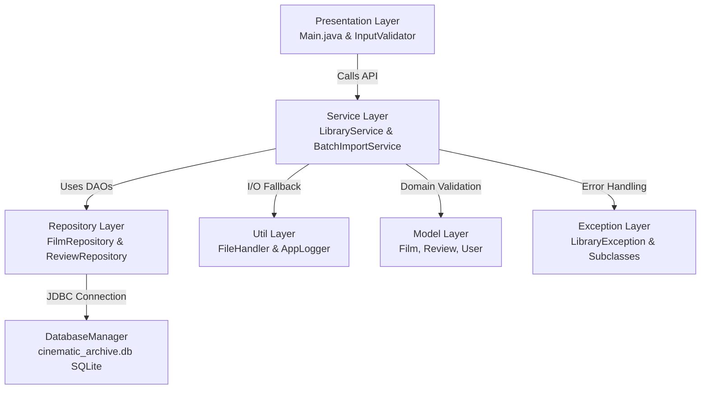

# Cinematic Archive & Review Engine

[]()
[]()
[]()
[]()
[]()

A modular, production-ready Java CLI application built to manage cinematic catalog records, relational user ratings, and asynchronous metadata ingestion. The system leverages an embedded SQLite database through JDBC for ACID-compliant persistence without requiring an external server daemon, and implements multi-threaded background workers for non-blocking batch imports.

Restructured strictly according to the **VITyarthi "Build Your Own Project"** evaluation standards and standard Maven project conventions.

---

## Architecture Overview



---

## Directory Structure

```text
C:\Vithyarthi java project main\
├── pom.xml                                      # Standard Maven Project Object Model
├── mvnw & mvnw.cmd                              # Cross-platform Maven Wrapper scripts
├── .mvn/wrapper/                                # Maven wrapper configuration & binaries
├── statement.md                                 # Formal VITyarthi Project Statement
├── README.md                                    # Comprehensive system documentation
├── cinematic_archive.db                         # Embedded SQLite database file
├── archive_data.txt                             # Flat-file backup / batch export dataset
├── Project Report.docx                          # Complete academic report & diagrams
├── src/
│   ├── main/
│   │   └── java/
│   │       └── com/vityarthi/library/
│   │           ├── model/                       # Encapsulated domain entities
│   │           │   ├── Film.java                # Film entity (ID, title, director, genre, year)
│   │           │   ├── Review.java              # Relational review entity (rating, critique)
│   │           │   └── User.java                # Member/user entity
│   │           ├── repository/                  # Data access and JDBC persistence layer
│   │           │   ├── DatabaseManager.java     # SQLite connection & schema initialization
│   │           │   ├── FilmRepository.java      # Parameterized CRUD operations for Films
│   │           │   └── ReviewRepository.java    # Parameterized queries for Reviews & averages
│   │           ├── service/                     # Core business & transactional logic
│   │           │   ├── LibraryService.java      # CRUD, filtering, reviews, rating aggregates
│   │           │   └── BatchImportService.java  # Multi-threaded asynchronous ingestion
│   │           ├── exception/                   # Custom domain exception hierarchy
│   │           │   ├── LibraryException.java    # Base unchecked exception
│   │           │   ├── ResourceNotFoundException.java
│   │           │   ├── InvalidDataException.java
│   │           │   └── DatabaseOperationException.java
│   │           ├── util/                        # Logging, I/O, and input sanitizers
│   │           │   ├── AppLogger.java           # Structured console logger with timestamps
│   │           │   ├── FileHandler.java         # CSV/flat-file serialization & deserialization
│   │           │   └── InputValidator.java      # Safe terminal scanner buffer clearance
│   │           └── Main.java                    # Interactive terminal CLI entry point
│   └── test/
│       └── java/
│           └── com/vityarthi/library/
│               └── LibraryServiceTest.java      # Automated JUnit 5 unit test suite
```

---

## Technologies & Dependencies

| Technology | Purpose |
| :--- | :--- |
| **Java (JDK 17+)** | Core programming language leveraging modern record/class design and concurrency. |
| **Apache Maven** | Standardized dependency management, compilation, and automated test execution. |
| **SQLite 3 (`org.xerial:sqlite-jdbc:3.45.1.0`)** | Embedded relational database engine with zero external daemon dependencies. |
| **JUnit 5 (`org.junit.jupiter:5.10.2`)** | Unit testing framework validating business rules, edge cases, and exceptions. |

---

## Prerequisites

- **Java Development Kit (JDK 17 or higher)** installed and available on system path.
- No standalone Maven or external database installation is required; the included **Maven Wrapper (`mvnw` / `mvnw.cmd`)** and embedded SQLite driver bootstrap everything automatically.

---

## Build & Execution Instructions

### 1. Running Automated Unit Tests
To execute the JUnit 5 test suite verifying business validation, database transactions, and error handling:

- **Windows (Command Prompt / PowerShell):**
  ```bash
  .\mvnw.cmd test
  ```
- **macOS / Linux:**
  ```bash
  ./mvnw test
  ```

### 2. Compiling and Packaging
To clean, compile, test, and package the application into an executable JAR:
```bash
.\mvnw.cmd clean package
```
The build produces both the standard library archive and a self-contained executable JAR (with all SQLite & SLF4J dependencies bundled) under `target/`:
* `target/cinematic-archive-1.0.0-jar-with-dependencies.jar` (Self-contained executable)
* `target/cinematic-archive-1.0.0.jar`

### 3. Launching the Application
Execute the self-contained executable JAR using Java:
```bash
java -jar target/cinematic-archive-1.0.0-jar-with-dependencies.jar
```

---

## Interactive CLI Menu Walkthrough

Upon startup, the system verifies and initializes the SQLite schema (`films` and `reviews` tables) before rendering the interactive menu:

```text
==========================================================
   Welcome to Cinematic Archive & Review Engine (CLI)    
==========================================================

--- MAIN MENU ---
1. Add a new Film
2. View all Films
3. Filter Films by Genre
4. Leave a Review
5. View Reviews for a Film
6. Run Background Batch Import (Concurrency)
7. Export Archive Data to File
8. Exit
Select an option (1-8):
```

### Key Menu Options

1. **Option 1: Add a new Film**
   - Prompts for Title, Director, Genre, and Release Year.
   - Validates that strings are not empty and release year is within a valid chronological range (1888–2100).
   - Automatically assigns a primary key ID and persists to SQLite.

2. **Option 2: View all Films**
   - Displays all stored catalog records formatted cleanly with IDs, directors, genres, and release years.

3. **Option 3: Filter Films by Genre**
   - Performs a case-insensitive search by genre (e.g., "Sci-Fi", "Drama", "Action") and lists all matching titles.

4. **Option 4: Leave a Review**
   - Validates that the targeted Film ID exists in the database.
   - Prompts for a numeric rating strictly between `1.0` and `5.0`.
   - Records reviewer critique text and links relationally via foreign key.

5. **Option 5: View Reviews for a Film**
   - Displays all historical reviews for the selected movie along with its dynamically calculated aggregate average rating.

6. **Option 6: Run Background Batch Import (Concurrency)**
   - Spawns a dedicated worker thread (`Worker-BatchImport`) implementing `Runnable`.
   - Asynchronously ingests sample films into the SQLite database with simulated latency.
   - Allows the user to continue interacting with the CLI menu while ingestion progresses concurrently.

7. **Option 7: Export Archive Data to File**
   - Backs up all database records to `archive_data.txt` in CSV format.

8. **Option 8: Exit**
   - Gracefully shuts down the application.

---

## Testing & Quality Assurance

The test suite (`LibraryServiceTest.java`) covers:
- ✅ Film creation with auto-generated primary key verification.
- ✅ Validation rules throwing `InvalidDataException` on blank titles or out-of-range release years.
- ✅ Foreign-key protection throwing `ResourceNotFoundException` on missing film references.
- ✅ Rating range enforcement (rejecting ratings `< 1.0` or `> 5.0`).
- ✅ Case-insensitive genre filtering.
- ✅ Accurate statistical calculation of multi-review average ratings.
- ✅ Isolated in-memory/target SQLite database lifecycle with `@BeforeEach` and `@AfterEach` fixtures.

---

## Key Design Decisions & Highlights

- **Repository Pattern:** Completely isolates SQL statements from UI and service logic. Adding or changing database engines requires zero changes to `LibraryService` or `Main`.
- **SQL Injection Prevention:** 100% of SQL statements employ parameterized `PreparedStatement` queries.
- **Scanner Safety:** `InputValidator` handles buffer flushes and catches `InputMismatchException` to prevent terminal loop lockups.
- **Embedded Portability:** Zero external database server configuration required.
